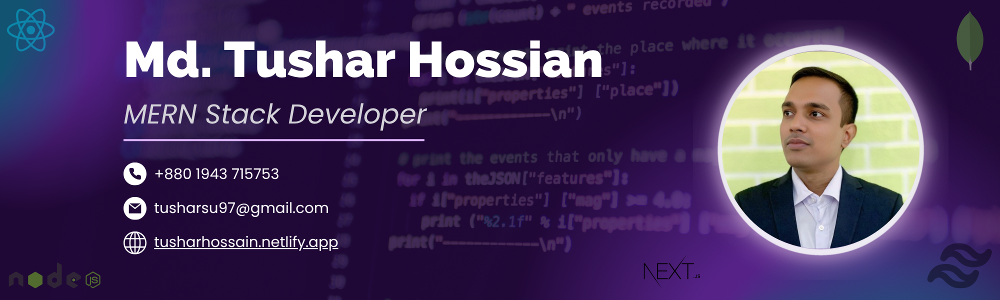

<p align="center">
  
</p>
<h3>
# 👋 Hi, I'm Tushar Hossain
</h3>

🎯 MERN Stack Developer | 💻 JavaScript Enthusiast | 🌍 Lifelong Learner 

---

## 🚀 About Me

I'm a passionate **MERN Stack Developer** from **Bangladesh**. I specialize in building modern, responsive, and scalable web applications using the MERN stack. I enjoy writing clean code and solving real-world problems through web development.

- 🎓 BSc in Computer Science and Engineering from Sonargaon University (Graduated: December 2024)
- 🔭 Currently working on personal and practice-based **MERN projects**
- 🌱 Preparing to become a full-stack developer by learning advanced tools and best practices
- 👨‍💻 Open to internships, freelance work, and entry-level developer opportunities
- ⚙️ Tech Stack: `React.js`, `Next.js`, `Node.js`, `Express.js`, `MongoDB`, `Tailwind CSS`
---

```javascript
const tushar = {
  pronouns: "he" | "him",
  code: [Javascript, HTML, CSS, Tailwind CSS],
  tools: [React, Next.js, Nodejs, MongoDB, Epressjs],
  architecture: ["microservices", "event-driven", "design system pattern"],
  techCommunities: {
                        coorganizer: "Javascript",
                        speaker: "English",
                        mentor: "Programming Hero"
                      },
 challenge: "I am doing the challenge focused on React.js, Next.js and Node.js"
}
```

## 🛠️ Tech Stack

### 🌐 Frontend


### 🧠 Backend


### 🛠 Tools


---

## 📈 GitHub Stats


| <a href="https://github.com/tushar-hossain/github-readme-stats"></a> | <a href="https://github.com/tushar-hossain/github-readme-stats"></a> |
| ------------- | ------------- |

---

<p></p>

---

## 📫 Let's Connect

- 📫 Email: tusharsu97@gmail.com
- 💬 WhatsApp: +880194371573
- 🌐 Portfolio: https://tusharhossain.netlify.app/
- 💼 LinkedIn: [https://www.linkedin.com/in/tushar-hossain-undefined-0361b4371/](#)
---

Thanks for visiting my profile! 🚀


