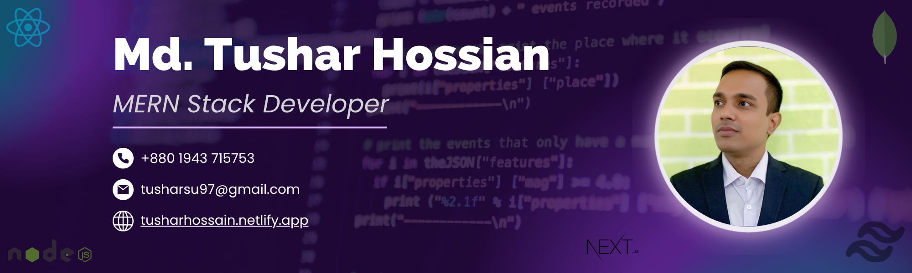

<p align="center">
  
</p>

<h1 align="center"> Hi, I'm Md. Tushar Hossain</h1>

<p align="center">
  <strong>React.js Developer | Junior Software Developer | MERN Stack Developer</strong>
</p>

<p align="center">
  I build responsive, maintainable, and user-friendly web applications with React.js, TypeScript, JavaScript, and modern web technologies.
</p>

---

## 🏢 Professional Experience

### Junior Software Developer — Edutechs Limited
**January 2026 – Present**

- Develop frontend modules for enterprise web applications using **React.js and TypeScript**.
- Work on business workflows including **HRM, invoicing, inventory, reservations, guest management, billing, payments, and reporting**.
- Build reusable and responsive UI components for complex application workflows.
- Integrate **Firebase Authentication, Firebase Realtime Database, and REST APIs**.
- Debug issues, improve existing features, and contribute to reliable user experiences.
- Collaborate with product, design, and QA teams during development and testing.

### Software Developer Intern — Edutechs Limited
**August 2025 – January 2026**

- Gained professional experience working in a software development environment.
- Contributed to frontend development and application improvements.
- Worked with modern web development tools and development workflows.
- Improved practical knowledge of React.js, JavaScript, TypeScript, APIs, and collaborative software development.

---

## 🚀 About Me

I'm a **Junior Software Developer at Edutechs Limited**, focused on building modern frontend applications and enterprise software using **React.js, TypeScript, Firebase, and REST APIs**.

My professional experience includes working on enterprise applications and business workflows such as **HRM, invoicing, inventory, reservations, billing, payments, reporting, and document management**. I enjoy turning complex requirements into reusable UI components and practical, maintainable solutions.

I also have a strong foundation in the **MERN stack** through personal projects and hands-on development.

- 💼 Currently working as a **Junior Software Developer at Edutechs Limited**
- ⚛️ Focused on **React.js, TypeScript, JavaScript, and frontend development**
- 🧩 Experienced with **Firebase Authentication, Realtime Database, and REST API integration**
- 🌱 Continuously learning modern tools and best practices
- 🛠️ Interested in building scalable, responsive, and user-friendly applications
- 📍 Based in **Dhaka, Bangladesh**

---

```javascript
const tushar = {
  pronouns: "he" | "him",
  code: [Javascript, HTML, CSS, Tailwind CSS],
  tools: [React, Next.js, Nodejs, MongoDB, Epressjs],
  architecture: ["microservices", "event-driven", "design system pattern"],
  techCommunities: {
                        coorganizer: "Javascript",
                        speaker: "English",
                        mentor: "Programming Hero"
                      },
 challenge: "I am doing the challenge focused on React.js, Next.js and Node.js"
}
```

## 🛠️ Tech Stack

### Frontend


 


### Backend


 

### 🛠️ Tools & Deployment


---

## 📌 Featured Projects

### 📦 GoCarry – Parcel Delivery Platform
A full-stack parcel delivery and logistics platform built with the MERN stack.

**Tech:** React.js, Node.js, Express.js, MongoDB, Firebase, Stripe, Tailwind CSS, Shadcn UI, TanStack Query

### 💬 Forum Web Application
A community forum application with user-focused features and modern responsive UI.

**Tech:** React.js, Node.js, Express.js, MongoDB, Tailwind CSS, Firebase

### 📚 BD Programming
An educational programming platform designed to provide a modern learning experience.

**Tech:** React.js, Node.js, Express.js, MongoDB, Tailwind CSS

---

## 🏆 Achievement

- 🥇 Participated in the **CSE Day Programming Contest 2023** at Sonargaon University using **C++**.

---

## 📈 GitHub Stats

---

<p align="center">
  
</p>

---

## 📫 Let's Connect

- 📧 **Email:** tusharsu97@gmail.com
- 💬 **WhatsApp:** +880194371573
- 🌐 **Portfolio:** https://tusharhossain.netlify.app/
- 💼 **LinkedIn:** https://www.linkedin.com/in/tushar-hossain-dev/
- 🐙 **GitHub:** https://github.com/tushar-hossain

---

<p align="center">
  Thanks for visiting my profile! 🚀
</p>

